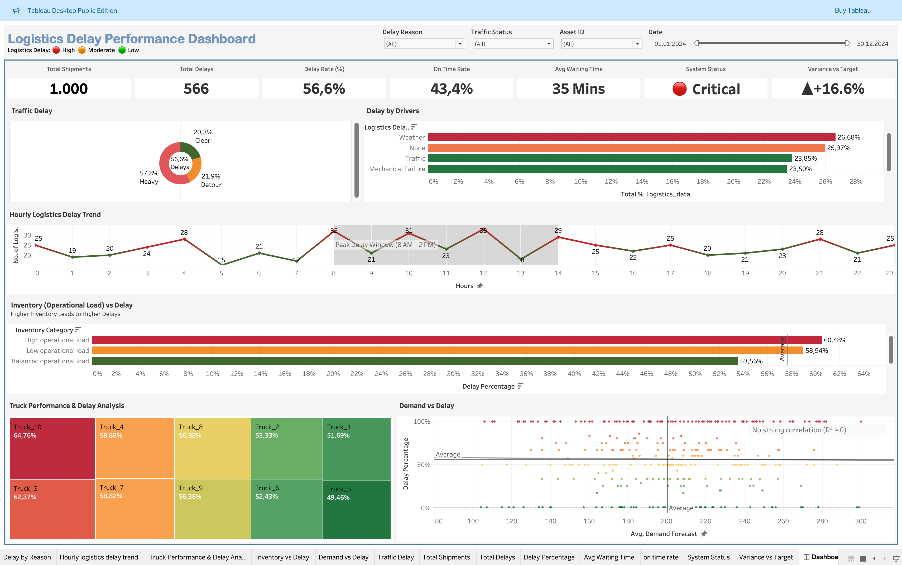

# 🚚 Smart Logistics Operations — Delay Intelligence Dashboard

> An end-to-end data analytics project to identify delay drivers, monitor operational KPIs, and enable data-driven decision-making in logistics operations.

---

## 📌 Project Overview

Designed and implemented a complete analytics pipeline to evaluate logistics performance across **1,000 shipments**, analyzing traffic conditions, inventory levels, asset utilization, and demand patterns.

This project simulates a real-world **Business Intelligence solution** enabling stakeholders to:
- Monitor critical KPIs at a glance
- Identify root causes of delays
- Track operational inefficiencies
- Take proactive corrective actions

🎯 **Role Alignment:** Data Analyst | Business Intelligence Analyst

---

## 🧠 Business Problem

Logistics operations frequently experience delays due to multiple interacting factors — traffic congestion, weather disruptions, inefficient inventory management, and underperforming assets.

**Objective:**
- Identify key delay drivers
- Monitor performance vs target
- Deliver actionable insights for optimization

---

## 🛠️ Tools & Technologies

| Tool | Purpose |
|---|---|
| Excel | Data cleaning & preprocessing |
| MySQL | Data storage & SQL analysis |
| Python (Pandas, Seaborn) | Data validation & exploration |
| Tableau Public | Interactive dashboard & storytelling |
| GitHub | Version control & project documentation |

---

## 📊 Dataset

- 📁 Total Records: **1,000 shipments**
- 📌 Total Features: **16 columns**
- 📅 Period: **January 2024 – December 2024**
- 🔗 Source: [Smart Logistics Supply Chain Dataset — Kaggle](https://www.kaggle.com/datasets/ziya07/smart-logistics-supply-chain-dataset)

### Key Fields

| Column | Description |
|---|---|
| Timestamp | Full datetime of shipment |
| Asset_ID | Truck identifier (Truck_1 to Truck_10) |
| Traffic_Status | Clear / Detour / Heavy |
| Logistics_Delay | 1 = Delayed, 0 = On Time |
| Logistics_Delay_Reason | Weather / Traffic / Mechanical / None |
| Inventory_Level | Stock level at time of shipment |
| Asset_Utilization | % utilization of truck |
| Demand_Forecast | Predicted demand units |
| Waiting_Time | Delay duration in minutes |
| Temperature | Temperature at time of shipment |
| Humidity | Humidity at time of shipment |

---

## 🧹 Data Cleaning (Excel)

The raw dataset had several issues that were fixed before analysis:

| Issue | Fix Applied |
|---|---|
| European decimal separators (`,`) | Replaced with `.` using Find & Replace |
| BOM encoding error (0xef byte) | Re-saved as plain CSV (not UTF-8 BOM) |
| Timestamp in custom format | Used `=MOD(F2,1)` to extract Time, `=INT(A2)` for Date |
| Tab-separated delimiter | Converted to comma-separated CSV |
| Missing Asset_ID column in SQL | Added `ALTER TABLE` after initial load |

---

## 🗄️ Database Setup (MySQL)

```sql
CREATE DATABASE logistics_project;
USE logistics_project;

CREATE TABLE logistics (
    Timestamp DATETIME,
    Date DATE,
    Time TIME,
    Asset_ID VARCHAR(20),
    Month_Number INT,
    Month_Name VARCHAR(10),
    Hours INT,
    Latitude FLOAT,
    Longitude FLOAT,
    Inventory_Level INT,
    Shipment_Status VARCHAR(20),
    Temperature FLOAT,
    Humidity FLOAT,
    Traffic_Status VARCHAR(20),
    Waiting_Time INT,
    User_Transaction_Amount INT,
    User_Purchase_Frequency INT,
    Logistics_Delay_Reason VARCHAR(50),
    Asset_Utilization FLOAT,
    Demand_Forecast INT,
    Logistics_Delay INT
);
```

Data loaded using:
```sql
LOAD DATA LOCAL INFILE '/path/to/logistics_data.csv'
INTO TABLE logistics
CHARACTER SET latin1
FIELDS TERMINATED BY ','
ENCLOSED BY '"'
LINES TERMINATED BY '\n'
IGNORE 1 ROWS;
```

---

## 🔍 SQL Analysis

10 business questions answered using SQL:

```sql
-- 1. Overall delay rate
SELECT 
    COUNT(*) AS total,
    SUM(Logistics_Delay) AS delays,
    ROUND(SUM(Logistics_Delay)*100.0/COUNT(*),2) AS delay_percentage
FROM logistics;

-- 2. Traffic impact on delays
SELECT 
    Traffic_Status,
    COUNT(*) AS total,
    SUM(Logistics_Delay) AS delays,
    ROUND(SUM(Logistics_Delay)*100.0/COUNT(*),2) AS delay_percentage
FROM logistics
GROUP BY Traffic_Status
ORDER BY delay_percentage DESC;

-- 3. Top delay reasons
SELECT 
    Logistics_Delay_Reason,
    COUNT(*) AS count
FROM logistics
WHERE Logistics_Delay = 1
GROUP BY Logistics_Delay_Reason
ORDER BY count DESC;

-- 4. Peak delay hours
SELECT 
    Hours,
    COUNT(*) AS total,
    SUM(Logistics_Delay) AS delays,
    ROUND(SUM(Logistics_Delay)*100.0/COUNT(*),2) AS delay_percentage
FROM logistics
GROUP BY Hours
ORDER BY delay_percentage DESC;

-- 5. Worst performing trucks
SELECT 
    Asset_ID,
    COUNT(*) AS total,
    SUM(Logistics_Delay) AS delays,
    ROUND(SUM(Logistics_Delay)*100.0/COUNT(*),2) AS delay_percentage
FROM logistics
GROUP BY Asset_ID
ORDER BY delay_percentage DESC;

-- 6. Inventory level vs delay
SELECT 
    CASE 
        WHEN Inventory_Level < 200 THEN 'Low'
        WHEN Inventory_Level BETWEEN 200 AND 400 THEN 'Medium'
        ELSE 'High'
    END AS inventory_category,
    COUNT(*) AS total,
    SUM(Logistics_Delay) AS delays,
    ROUND(SUM(Logistics_Delay)*100.0/COUNT(*),2) AS delay_percentage
FROM logistics
GROUP BY inventory_category;
```

---

## 🐍 Python Validation

```python
import pandas as pd
import seaborn as sns
import matplotlib.pyplot as plt

df = pd.read_csv("logistics_data.csv")

# Standardize column names
df.columns = df.columns.str.strip().str.replace(" ", "_").str.lower()

# Check missing values
df.isnull().sum()

# Delay distribution
df['traffic_status'].value_counts()

# Correlation analysis
df.corr(numeric_only=True)

# Demand vs Delay scatter plot
df['delay_percentage'] = df['logistics_delay'] * 100

sns.scatterplot(
    data=df,
    x='demand_forecast',
    y='delay_percentage',
    hue='traffic_status',
    alpha=0.7
)
plt.title("Demand Forecast vs Delay % (Colored by Traffic)")
plt.xlabel("Demand Forecast")
plt.ylabel("Delay Percentage")
plt.show()
```

---

## 📊 Key KPIs

| KPI | Value |
|---|---|
| Total Shipments | 1,000 |
| Total Delays | 566 |
| Delay Rate | 56.6% |
| On-Time Delivery Rate | 43.4% |
| Average Waiting Time | 35 mins |
| Target Delay Rate | 40% |
| Variance from Target | +16.6% (Critical 🔴) |

---

## 💡 Key Insights

| # | Finding | Impact |
|---|---|---|
| 1 | Heavy traffic shows the highest delay rate (~57–60%) | Critical |
| 2 | Weather is top delay reason (26.68%) | High |
| 3 | Peak delays between 8AM–2PM | High |
| 4 | Truck_10 has 64.76% delay rate | High |
| 5 | High inventory levels show higher delays (~60.48%) | Medium | 
| 6 | Balanced inventory (200–400 units) = best performance (~53.6%) | Positive |
| 7 | No strong correlation between demand and delay | Low risk |

---

## 🚀 Business Recommendations

1. **Route Optimization** — Avoid heavy traffic routes using real-time routing systems
2. **Weather Planning** — Integrate weather-based delivery contingency alerts
3. **Time Scheduling** — Schedule deliveries outside 8AM–2PM peak window
4. **Asset Maintenance** — Service Truck_10 and Truck_3 immediately
5. **Inventory Balance** — Maintain Operational Load between 200–400 units for optimal performance

---

## 📸 Dashboard Preview



---

## 📁 Project Structure

```
smart-logistics-analytics/
├── data/
│   └── smart_logistics_dataset.csv
├── Excel/
│   └── logistics_data.csv
├── sql/
│   ├── Smart_logistics.sql
├── python/
│   └── logistics_exploration.ipynb
├── dashboard/
│   └── Dashboard.png
├── images/
│   └── charts/
└── README.md
```

---

## 🚀 How to Run

### MySQL
```bash
# 1. Import dataset into MySQL Workbench
# 2. Run sql/logistics_setup.sql
# 3. Run sql/logistics_analysis.sql
```

### Python
```bash
pip install pandas seaborn matplotlib
jupyter notebook python/logistics_exploration.ipynb
```

### Tableau
- Open Tableau Public
- Connect to `logistics_data.csv`
- Or view dashboard in tableau file

---

## 👤 Author

**Your Name Here**
🔗 LinkedIn: *(https://linkedin.com/in/muthyalatharunteja)*
💻 GitHub: *(https://github.com/muthyalatharunteja)*

---

## 📄 License

For educational and portfolio use only.
